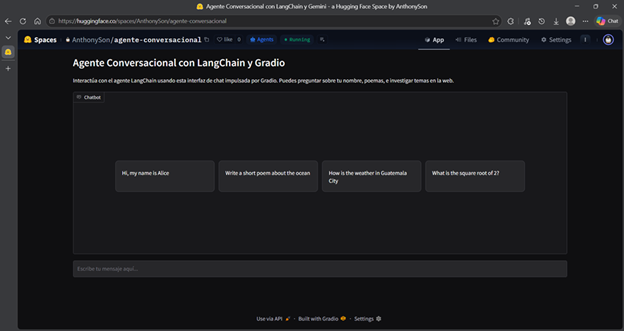
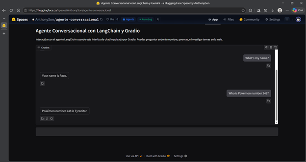

# 🤖 Agente Conversacional con LangChain y Gemini

Un agente conversacional inteligente que combina el poder de LangChain, Google Gemini y herramientas útiles para responder preguntas, realizar cálculos y buscar información en la web. Desarrollado con una interfaz Gradio para una experiencia de chat interactiva.

[Aplicación desplegada](https://huggingface.co/spaces/AnthonySon/agente-conversacional)

## ✨ Características

- **Modelo de Lenguaje**: Utiliza `gemini-2.5-flash-lite` de Google para respuestas inteligentes
- **Herramientas Integradas**:
  - 🔍 Búsqueda web con DuckDuckGo
  - 🧮 Calculadora matemática segura
  - 🌤️ Información del clima (simulada)
- **Interfaz Interactiva**: Chat web con Gradio
- **Gestión de Memoria**: Middleware de resumen para mantener conversaciones largas eficientes

## 🚀 Cómo Usar

1. Escribe tu mensaje en el cuadro de chat
2. El agente responderá usando las herramientas disponibles según sea necesario
3. ¡Pregunta sobre cualquier tema, realiza cálculos o busca información!

### Ejemplos de Preguntas

- "Hola, mi nombre es Ana"
- "Escribe un poema corto sobre el océano"
- "¿Cómo está el clima en Ciudad de Guatemala?"
- "¿Cuál es la raíz cuadrada de 16?"

### Aplicación

- Ejecución de la aplicación



- Ejemplo de interacción con el agente



## 🛠️ Detalles Técnicos

### Tecnologías Usadas

- **LangChain**: Framework para agentes conversacionales
- **Google Gemini**: Modelo de lenguaje avanzado
- **Gradio**: Interfaz web para el chat
- **DuckDuckGo**: Búsqueda web privada
- **LangGraph**: Gestión de estado y memoria

### Configuración de API

Este Space requiere una clave de API de Google Gemini. Para configurar:

1. Ve a [Google AI Studio](https://aistudio.google.com/apikey)
2. Crea una nueva clave de API
3. En tu Space de Hugging Face, ve a Settings > Secrets
4. Añade `GEMINI_API_KEY` como secreto

### Archivos del Proyecto

- `app.py`: Script principal del agente y interfaz Gradio
- `requirements.txt`: Dependencias de Python

### Instalación y Ejecución

#### Prerrequisitos

- Python 3.10 o superior
- Clave de API de Google Gemini

#### Pasos de Instalación

1. **Clona el repositorio**:
   ```bash
   git clone https://github.com/LinkSon-PC/Proyecto-agente-conversacional
   cd proyecto-agente-conversacional
   ```

2. **Instala las dependencias**:
   ```bash
   pip install -r requirements.txt
   ```

3. **Configura la clave de API**:
   - Crea un archivo `.env` en la raíz del proyecto
   - Añade tu clave de API de Google Gemini:
     ```
     GEMINI_API_KEY=tu_clave_api_aqui
     ```

#### Ejecución de la Aplicación

1. **Ejecuta el script principal**:
   ```bash
   python app.py
   ```

2. **Accede a la aplicación**:
   - Abre tu navegador web
   - Ve a la URL que se muestra en la terminal (generalmente `http://127.0.0.1:7860`)

3. **Interactúa con el agente**:
   - Escribe mensajes en el chat
   - El agente responderá utilizando las herramientas disponibles

## 📄 Licencia

Este proyecto está disponible bajo la licencia MIT. Siéntete libre de adaptarlo y usarlo según tus necesidades.

---

Desarrollado con ❤️ usando Hugging Face Spaces
